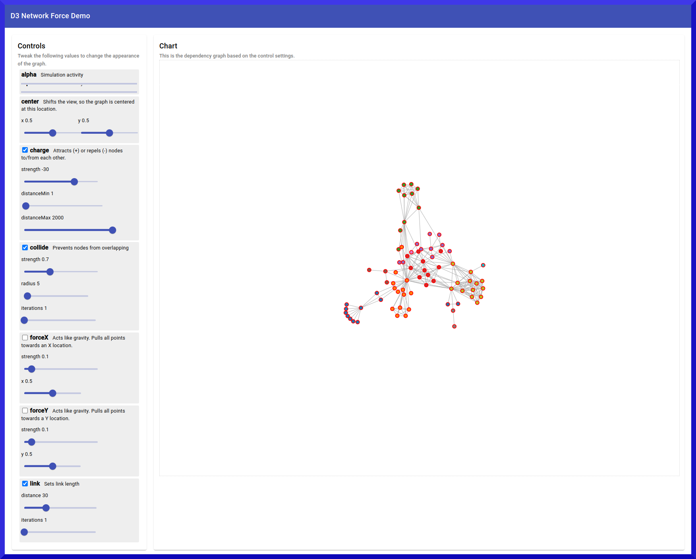

# D3 Network Force NG

Demo Angular v17 application demonstrating D3 network force diagram.

## Summary

This demo lets you interactively try various settings and combinations of forces for [d3-force](https://github.com/d3/d3-force).

It's based on [Mike Bostock's](https://bost.ocks.org/) example code for a [force directed graph](http://bl.ocks.org/mbostock/2675ff61ea5e063ede2b5d63c08020c7).

In order to make this demo more Angular like, I have integrated the actions into the proper Angular life cycle hooks and have replaced the plain input controls with the nicer looking Material components.

## References

* [d3](https://d3js.org)
* [d3 hierarchy](https://d3js.org/d3-hierarchy)
* [force directed graph](https://observablehq.com/@d3/force-directed-graph/2)
* [demo](https://gist.github.com/steveharoz/8c3e2524079a8c440df60c1ab72b5d03)
* [miserables.json](https://gist.githubusercontent.com/steveharoz/8c3e2524079a8c440df60c1ab72b5d03/raw/7c039c6b78eea9c97ce763e5fddbfa47c99661f9/miserables.json)
* [stackblitz example](https://stackblitz.com/edit/angular-13-template-jq8khd?file=src%2Fapp%2Fapp.component.ts)
* [Angular](https://angular.dev)
* [Material](https://material.angular.io)
